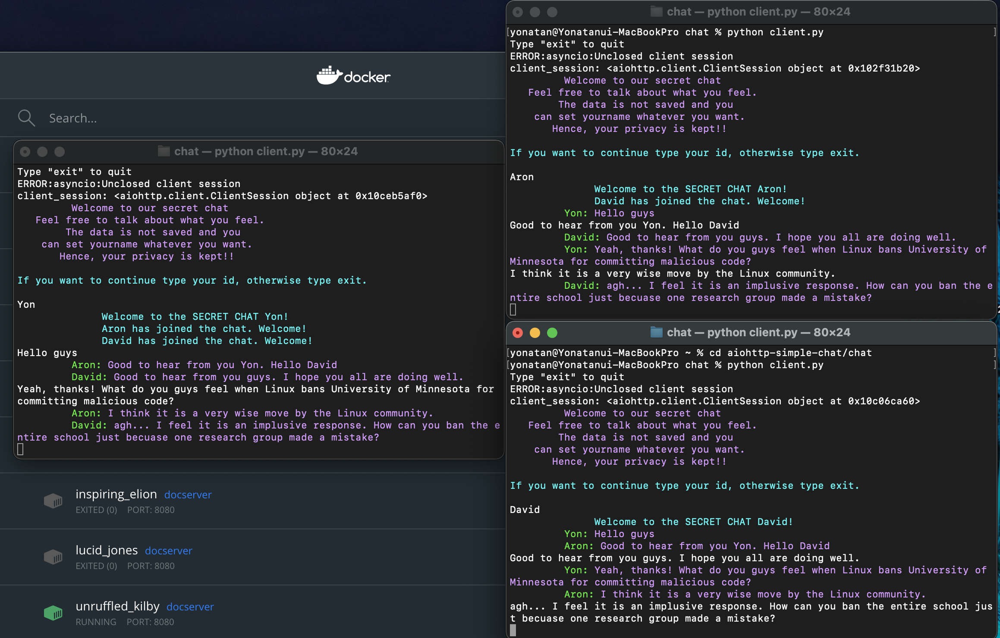

# aiohttp-terminal-chat

A simple chatting app built based on aiohttp framework that has only one common chatting group.

The app is build with minimal functionality. It won't save any messages to the database. It was built to be used in a setting in which secret messages are meant to be exchanged between one group of people. Because of that I only used the websockets for purpose of excahnging multiple messages between the clients, and other libraries including databases were not used. 

## Demo

### Functionality
- Each client can provide there names to the server at the start of the chat
- To prevent confusion, I used a color codded printing formatting

## Installation
- Clone the repository. 
```angular2html
$ git clone https://github.com/Emegua/aiohttp-simple-chat.git
$ cd chat
```
- Install the dependencies.
```angular2html
$ pip install -r requirements.txt
```
- Run the server app:
```angular2html
$ python app.py
```
- Run the client app [ For now, for simplicity, It is assumed that the server and the clients are running on the same machine, and you don't need to specify the server's Ip and host. A default value http://0.0.0.0/8080 is provided already ]
```angular2html
$ python client.py
```
**To simulate multiple clients, please open as many terminals as possible and join the chat**

## References
- https://docs.aiohttp.org/en/2.0.3/web.html
- https://docs.aiohttp.org/en/2.0.3/client.html
- https://docs.python.org/3/library/asyncio.html